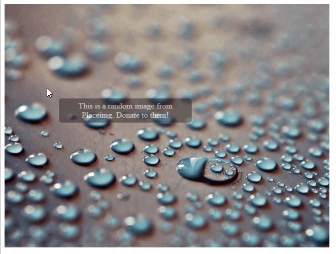

# jquery.YACSSTooltip

Yet Another CSS Tooltip jQuery Plugin - Adds a CSS tooltip for the images in a jQuery selection set.

This small plugin (866 bytes minified and gzipped) adds a visible tooltip to any element with a `title` or `alt` attribute:



It uses the text in the `title` attribute first or the text in `alt` in case the title is not available. To prevent the system's native tooltip to be shown, it disables the `title` if present and restores it again after the CSS Tooltip has been hidden.

It takes into account the limits of the viewport so that it doesn't overflow through the right or the bottom. 

## Usage

You can download the minified, ready for production version of the plugin (in the `dist` folder of this repo) and just reference it from your HTML, after jQuery:

```html
<script src="js/jquery.min.js"></script>
<script src="js/jquery.YACSSTooltip.min.js"></script>
```

Now, just select the elements you want to add the tooltip to and call the `addTooltip` method:

```javascript
$(function() {
    $('.article img').addTooltip();
});
```

Since its a well behaved jQuery plugin, you can make calls in a fluent way and act over the elements set after adding the tooltip. For example:

```javascript
$(function() {
    $('.article img').addTooltip().css('border', '5px solid red');
});
```

in this case we're adding a red solid border to the images after activating the tooltip feature in them.

Check the `index.html` sample file in the root of this folder to see it in action.

That's it!

## Look&Feel

Only one hidden element at the end of the body is used to show as many tooltips as are needed, so it doesn't fill your DOM. 

This element has a random id to prevent collisions, and defines the default look&feel as an inline style.

It has a `.YACSSTooltip` applied, so you can easily change any default property of the tooltip by adding a CSS selector for that class. You should use the `!important` modifier to override the inline styles. For example:

```css
.YACSSTooltip {
    border-radius: 0;
}
```

in order to remove the rounded borders.

## Build the production version

In order to build the production version form the source you just need to run the npm `build` task defined in the `package.json` file:

```bash
npm run build
```

and it will generate the minified version and the debugging map inside the `dist` folder. It will automatically add the version in the package to the license comments in the file.

## License
This software is released under the permissive MIT license. Check the details [here](https://github.com/jmalarcon/jquery.YACSSTooltip/blob/master/LICENSE).